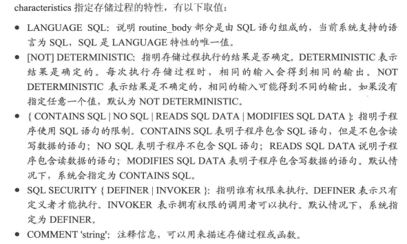

# 存储过程和函数

存储过程就是一条或者多条sql语句的集合，可视为批文件。

## 创建存储过程和函数

### 创建存储过程
* `create procedure sp_name([in|out|inout param_name type])
[characteristics ...]
begin
procedure_body;
end;`

* `create procedure avg_sal(out param1 int)
begin
    select ename,avg(sal) from tb_emp;
end;`

### 创建存储函数
* `create function func_name([in|out|inout param_name type])
returns type
[characteristics ...]
routine_body
`
* `set global log_bin_trust_function_creators=TRUE;`
* `create function namebyzip()
returns char(50)
return (select ename from tb_emp where job='程序员')`

### 变量的使用
* declare myparam int default 100:定义变量，在函数内部使用
* set var_name=expr \[,var_name=expr] ...:为变量赋值
* select 字段 into var_name tabel_expr:通过查询为变量赋值

### 定义条件
* declare condition_name condition for \[condition_type]:定义条件
* declare hander_type handler for condition_value sp_statement:定义处理程序

### 光标的使用
查询语句可能返回多条记录，如果数据量非常大，需要在储存过程和储存函数中使用光标来逐条查询结果中的记录。

* declare cursor_name cursor for select_statement:定义光标
* open cursor_name：打开光标
* fetch cursor_name into var_name \[,var_name]...：使用光标
* close cursor_name:关闭光标。

### 控制流程的使用
* IF expr_statement then satement_list end if:IF判断的使用
* case case_expr then statement_list ... end case:case的使用
* loop statement_list end loop:重复执行语句

* **以上的变量、光标、控制流程都在创建存储过程或者函数中使用**

## 调用存储过程和函数
* call sp_name(parameter):调用存储过程
* `create procedure avg_sal1(in no int,out num int)
begin
    select avg(sal) into num from tb_emp where dno=no;
end;`
* `call avg_sal1(20,@num);`
* `select @num;`

* `create function func_sal(no int)
returns int
begin
    return (select avg(sal) from tb_emp where dno=no);
end;`
* select func_sal(20);调用函数

## 查看存储过程函数
* show procedure|function status like 'a%';以a开头的储存过程
* show creat procedure|function sp_name|func_name;查看存储过程或函数
* select * from information_schema.ROUTINES where ROUTINE_NAME='avg_sal';

## 修改储存过程和函数
* alter procedure|function sp_name|func_name \[characteristic]

## 删除储存过程和函数
* drop procedure|function \[if exist] sp_name|func_name:删除

