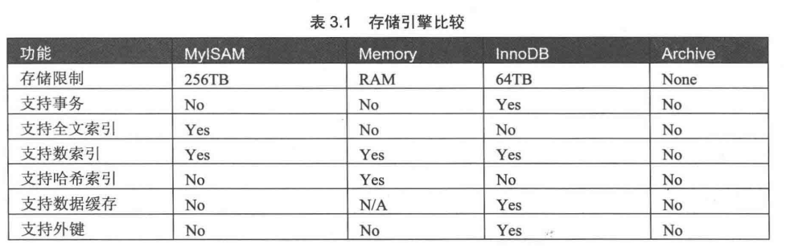

# 数据库的基本操作

## 创建数据库
show databases

create database databasename

## 删除数据库
drop database databasename

## 数据库储存引擎
数据库底层软件组件，不同的数据引擎提供不同的数据储存、查询功能

### mysql储存引擎
show engines 查看支持的引擎类型

* innoDB引擎：事务型数据库引擎，支持事物安全表，支持行锁定和外键。默认引擎大数量
* MyISAM引擎：Web、数据存储和其他应用环境，不支持事务
* MEMORY引擎：将表数据储存在内存中，为查询和引用其他数据表提供快速访问。

不同的引擎比较

查看默认引擎
show databases like 'storage_engine'