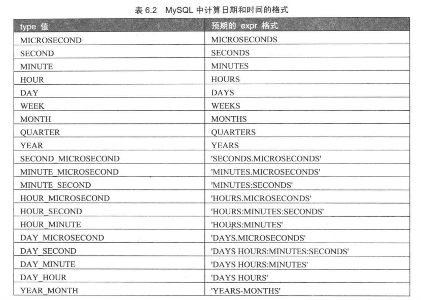
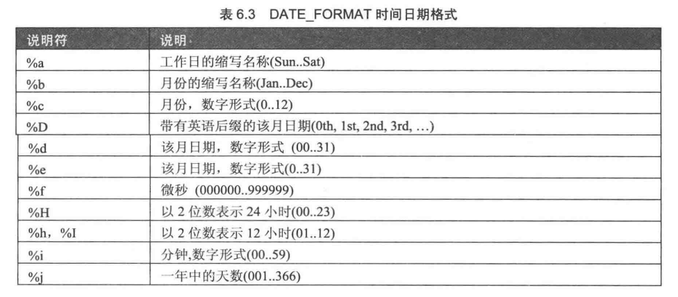
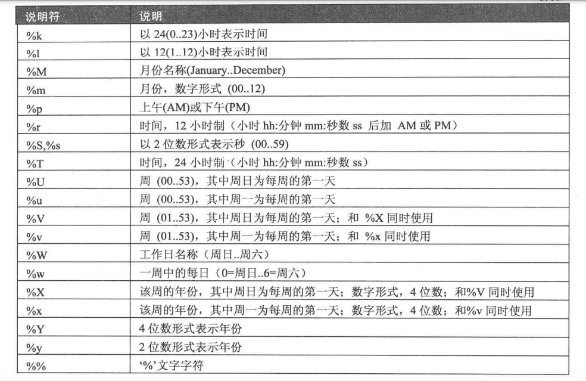

# MySQL函数

## 函数简介
数学函数，字符串函数，日期和时间函数，条件判断函数

## 数学函数
* ABS(s),PI():绝对值和圆周率
* SQRT(X),MOD(x,y):平方根和求余函数
* **CEIL(X),CEILING(x),FLOOR(X):取整函数**
* RAND(),RAND(x):生成随机数，x是随机种子
* ROUND(x)、ROUND(x,y)、TRUNCATE(x,y):四舍五入，y是小数位、直接去掉小数后的值
* SIGN(X):符号函数，负数、0、正数：-1，、0、1
* POW(x,y)、POWER(x,y)、EXP(x):x的y次方，e的x次方
* LOG(X)、LOG10(x)
* RADIANS(x)、DEGREES(x):角度和弧度互换函数
* SIN(x)/ASIN(x)：正选和反正炫、其他的都一样

## 字符串函数
* CHAR_LENGTH(str):返回字符串字符个数
* LENGTH(str):计算字符串字节长度，一个汉字是三个字节
* CONCAT(s1,s2,..)/CONCAT_WS(x,s1,s2,..):拼接字符串，x是拼接符
* INSERT(s1,x,len,s2):s1的x位置开始替换为s2
* LOWER/LCASE、UPPER/UCASE:大小写转换
* LEFT(s,n)、RIGHT(s,n):获取左边还是右边的n个字符
* LPAD(s1,len,s2)、RPAD(s1,len,s2):字符串填充
* LTRIM(s)、RTRIM(S)、TRIM(s):删除字符串的空格符
* TRIM(s1 FEOM s):删除s中的s1
* REPEAT(s,n) :生成重复字符串
* SPACE(n)、REPLACE(s,s1,s2):空格符函数和替换函数
* STRCMP(s1,s2):字符串比较大小
* SUBSTRING(s,n,len)、MID(s,n,d):获取子字符串
* LOCATE(str1,str2)/POSITION(str1,str2)/INSTR(str,str2):返回字符串在其中开始位置
* REVERSE(s):字符串翻转
* ELT(n,s1,s2,s3,...):获得指定位置的字符串
* FIELD(s,s1,s2,s3,...):s1首次出现时的位置
* FIND_IN_SET(s1,s2):s1:在字符串列表s2中的位置
* MAKE_SET(x,s1,s2,...):返回由x的二进制数指定的相对应的字符串

## 时间和日期函数
* CURDATE()/CURRENT_DATE()/CURRENT_TIME()/CURRENT_TIMESTAMP()/NOW(:获得当前日期
* UNIX_TIMESTAMP(date):时间戳
* UCT_DATE():世界标准日期
* MONTH(date)/MONTHNAME(date)：从日期里面获取月份
* DAYNAME()/DAYOFWEEK(D)/WEEKDAY():返回星期几，一周的第几天
* WEEK(D)/WEEKOFYEAR():一年中的第几周
* DAYOFYEAR()/DAYOFMONTH():第几天
* YEAR(D)/QUARTER(D)/MINUTE(D)/SECOND(D)：年、季度、分钟、秒
* EXTRACT(TYPE FROM DATE):获取日期中的一部分
* TIME_TO_SEC:时间转换为秒
* DATE_ADD(DATE,INTERVAL,EXPR TYPE)/DATE_SUB(DATE,INTERVAL,EXPR TYPE):日期计算

* DATEDIFF(D1,D2):计算两个时间的差
* DATE_FORMAT(DATE,FORMAT):将日期格式化，format='%W %M %Y'等

* GET_FORMAT:指定显示的日期格式

## 条件判断函数
* IF(EXPR,V1,V2):为真时取v1否则取v2
* IFNULL(v1,v2):判断是否是NULL
* CASE expr WHEN v1 THEN v2 ELSE v3 END:如果expr为v1则取v2

## 系统信息函数
* VERSION():查看数据库版本
* CONNECTION_ID():查看数据库的连接次数
* SHOW PROCESSLIST/SHOW FULL PROCESSLIST：查看线程情况
* DATABASE()/SCHEMA():返回数据库名
* USER()/CURRRENT_USER/SYSTEM_USER/SESSION_USER：返回当前的用户名和主机名
* CHARSET():返回字符串使用的字符集
* COLIATION():返回字符串的排列方式
* LAST_INSERT_ID():返回最后一个自动生成的ID值

## 加/解密函数
* PASSWORD(STR):加密函数
* MD5(STR):返回MD5加密
* ENCODE(STR,PSWD_STR):使用pswd_str对str进行加密，DECODE可解码

## 其他函数
* FORMAT(X,N):将数字x格式化，以四舍五入的方法保存小数点后n位，以字符串输出
* CONV(N,FROM_BASE,TO_BASE):不同进制的数字之间的转换
* INET_ATON(EXPR):将ip地址转换为整数，INET_NTOA:转为ip
* GET_LOCK(STR,TIMEOUT):指定字符串获得锁
* BENCHMARK(COUNT,EXPR):重复执行expr表达式N次
* CONVERT(STR1 UNSING ):转换不同的字符集
* CAST(x,AS type)/CONVERT(X,TYPE):改变x的数据类型

## 注意
* **mysql中的所有函数不能直接使用，需要select+函数，除了有show字段的除外，例如select md5('newsss');和show processlist ;**