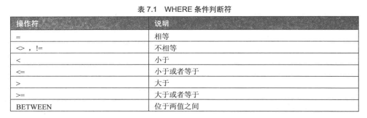
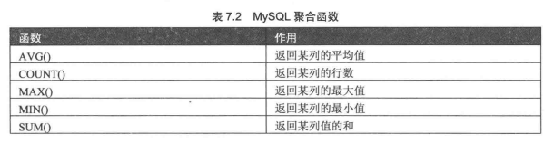
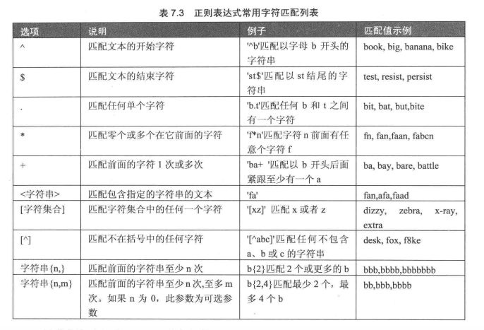

# 查询数据

## 基本的查询语句

### WHERE
* select 字段1,字段2,... from tb_name:从表中查询指定字段
* select 字段1,字段2,... from tb_name where expr:从表中查询指定字段,限定条件

* select 字段1,字段2,... from tb_name where 字段 IN/NOT in (s1,s2,...):从表中查询指定字段,并限定字段的范围
* select 字段1,字段2,... from tb_name where 字段 between 小值 and 大值:从表中查询指定字段，并限定范围
* select 字段1,字段2,... from tb_name where 字段 like 'a%'':从表中查询指定字段,限定通配符

"a%y":a开头，y结尾；'a___y':a开头，y结尾，中间有3个字符

* select 字段1,字段2,... from tb_name where 字段 IS [NOT] NULL:从表中查询指定字段,查找空值
* select 字段1,字段2,... from tb_name where expr1 and/or expr2 :从表中查询指定字段,多条件查询
* select distinct 字段1,字段2,... from tb_name where expr:从表中查询指定字段,限定不重复

### 排序
* select 字段1,字段2,... from tb_name order by 字段1 desc,字段2 asc:查询数据并按照指定字段排序

### 分组
* select 字段1,count(*) from tb_name group by 字段1:从表中分组查询指定字段1，并统计每组有多少个
* select 字段1,group_concat(字段2) as names from tb_name group by 字段1:从表中分组查询指定字段1，并统计每组有哪些名称
* select 字段1,count(*) from tb_name group by 字段1 having count(字段2)>2:从表中分组查询指定字段1，并统计每组有多少个,显示个数大于2
* select 字段1,count(*) from tb_name group by 字段1 with rollup:从表中分组查询指定字段1，并统计每组有多少个,最后增加一行，统计总和
* select 字段1,字段2,count(*) from tb_name group by 字段1 order by 字段2:gourp by 和order by一起用

### limit
* select 字段1,字段2,... from tb_name limit m,n:从表中查询指定字段,显示从第m个记录开始的n行

## 聚合函数
有时候并不需要显示原数据，而是需要原数据的汇总

* select max(字段1),min(字段2),... from tb_name:从表中查询指定字段的汇总情况

## 连接查询
内连接、外连接
### 内连接
* select 字段1,字段2,... from tb1,tb2 where tb1.字段=tb2.字段:从表中查询指定字段,当两个表的字段相等时显示
* select 字段1,字段2,... from tb1 inner join tb2 on b1.字段=tb2.字段:从表中查询指定字段，和上一个查询的结果一样

### 外连接
* 左连接：左表作为主表
* select 字段1,字段2,... from tb1 left outer join tb2 on b1.字段=tb2.字段:从表中查询指定字段，左表作为主表

* 右连接:右表作为主表
* select 字段1,字段2,... from tb1 right outer join tb2 on b1.字段=tb2.字段:从表中查询指定字段，右表作为主表

## 子查询

### 带any、some的子查询

* sellect 字段1 from tb1 where 字段1 >any(select 字段2 from tb2)：大于任何一个数
* sellect 字段1 from tb1 where 字段1 >all(select 字段2 from tb2)：大于所有数
* sellect 字段1 from tb1 where [not] exist(select 字段2 from tb2):查询记录是否存在
* sellect 字段1 from tb1 where 字段1 in(select 字段2 from tb2):查询记录是否存在

### 带比较运算符的子查询

* sellect 字段1 from tb1 where 字段1 >[=][<][!=](select 字段2 from tb2)

## 合并查询结果
利用UNION关键字合并多条select语句的结果,两个表对应的列数和数据类型要相同，类似于纵向拼接
* sellect 字段1 from tb1 where expr union [all] select 字段2 from tb2

## 为表和字段取别名
在聚合函数或者子查询中使用as为字段和表取别名，as紧跟字段或表的后面
* select 字段1,count(*) as count_num from tb_name group by 字段1:从表中分组查询指定字段1，并统计每组有多少个

## 使用正则表达式查询
MySQL中使用regexp关键字指定正则表达式的字符匹配模式

* select 字段1,字段2,... from tb_name where 字段1 regexp '^b':从表中查询指定字段以b开头
* select 字段1,字段2,... from tb_name where 字段1 regexp 'bb|cc':从表中查询指定字段中含有bb或者cc
* select 字段1,字段2,... from tb_name where 字段1 regexp '[bc]':从表中查询指定字段中含有b或者c
* select 字段1,字段2,... from tb_name where 字段1 regexp '[^a-e1-3]':从表中查询指定字段中不含a-e和1-3

