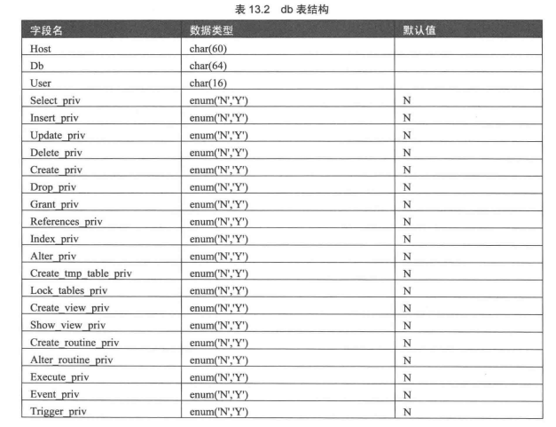
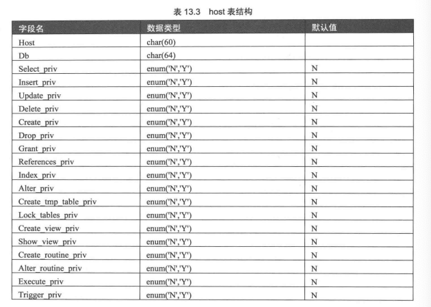
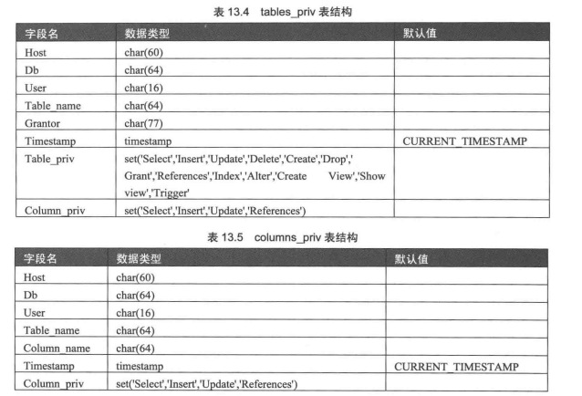
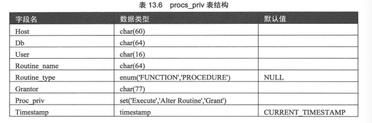
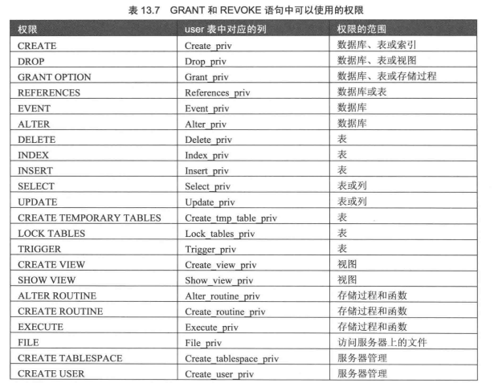
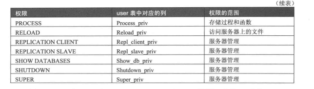
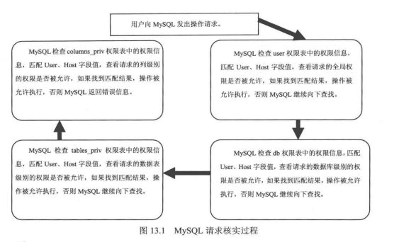

# MySQL用户管理
mysql是一个多用户数据库，具有强大的访问控制系统，用户分为普通用户和root用户，root用户是超级管理员，拥有所有的权限。

## 权限表
MySQL服务器通过权限表来控制用户对数据库的访问

### user表
记录允许连接到服务器的账号信息，里面的权限是全局级的。比如一个用户被赋予delete权限，则该用户可有输出数据库
中所有记录的权利。
* 用户列：Host、user、password分别表示主机名、用户名和密码。
* 权限列：描述了在全局范围内允许用户对数据和数据库进行的操作。字段类型为ENUM，可取Y和N。可通过grant和update更改字段的值。
* 安全列：共有6个字段，两个是sql相关，两个是x509相关，另外两个是授权插件相关的。ssl用于加密、x509用于标识用户、
lpugin字段可为验证用户身份的插件，如果为空，则使用数据库内部验证机制。
* 资源控制列：max_questions：用户每小时允许的查询次数。
* 资源控制列：max_updates：用户每小时允许的更新次数。
* 资源控制列：max_connections：用户每小时允许的连接次数。
* 资源控制列：max_user_connections：用户允许同时建立的连接次数。

### db表和host表
db表储存了用户对某个数据库的操作权限，host表中储存了某个主机对数据库的操作权限

user表是针对所有数据库的，db和host是针对部分数据库的， 如果只希望用户对某个数据库有权限，需要
将user中的权限设置为N，然后修改db表和host表

### table_pri和columns_pri表
设置对表的操作权限和列的操作权限

### procs_pri表
用户对储存过程和储存函数的操纵权限

## 账户管理

### 登录和退出服务器
* mysql -h localhost -u root -p\[password]:登录数据库，-p后面不能有空格
* mysql -h localhost -u root -p 数据库 -e 'desc table':登录特定数据库并执行命令后退出
* create user 'cbb'@'localhost' identified by 'lcd520';创建用户，不用主机和密码登录时不用写出对应命令。
* grant select,update on *.* to 'cbb'@'localhost';:赋予用户在所有数据库(*)上的所有表(*)上拥有selec和update权限。
* 解决没有grant权限：
`use mysql;
update user set host='%' where user='root';`
* **8.0版本的MySQL不允许用grant创建用户了。**
* select HOST,USER,Select_priv,Update_priv from mysql.user where User='cbb';其中selec和update被允许。
* 通过向user里面插入记录创建用户
* `insert into user (host,user,authentication_string,select_priv,insert_priv,update_priv,
ssl_cipher,x509_issuer,x509_subject) values(‘localhost’,‘guest’,MD5(‘guest123’),‘Y’,‘Y’,‘Y’,‘0x’,‘0x’,‘0x’)`

### 删除用户
* drop user 'cbb'@'localhost';
* delete from mysql.user where host='hostname' and user='user_name';

### root用户修改密码
* mysqladmin -u username -h localhost -p password 'newpwd';password是关键字，username为root
* update mysql.user set authentication_string=password('newpwd') where user='root' and localhost='localhost';
* set password=password('newpwd');修改root的密码，如果是普通用户则是普通用户修改自己的密码
* set password for 'user'@'host'=password('newpwd');修改普通用户的密码

## 权限管理
grant和revoke中可以使用的权限
* grant 权限 on * to user;赋权
* revoke 权限 on * from user;收回权限

* show grants;查看权限

## 访问控制

### 连接核实
当连接mysql服务器时，服务器基于用户的身份以及用户是否能通过正常的密码验证来接受或是拒绝连接。

### 请求核实
建立连接以后，服务器进入访问控制阶段。

* **flush privileges;**权限设置好了以后要刷新
* **别人远程连接的话需要输入自己的本机ip而不是localhost，终端输入ipconfig查看ip**